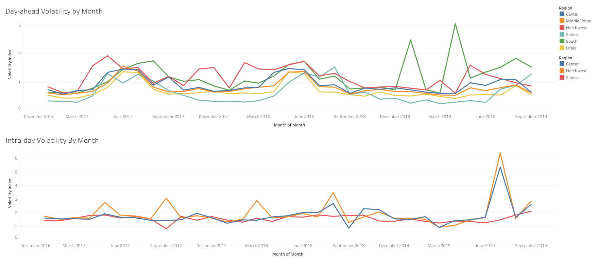
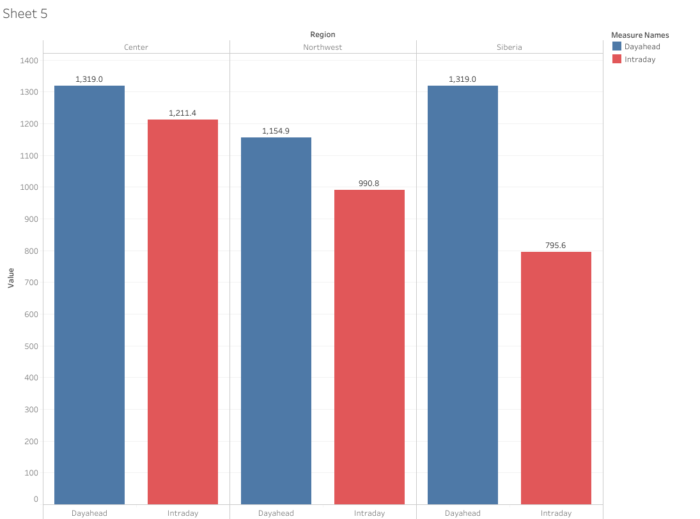

# ⚡ Electricity Market SQL Analysis

## 📖 Overview
Analyze Russian wholesale electricity market data (day‑ahead and intraday prices, plus consumption volumes) to uncover:
- Regional price volatility
- Differences between day‑ahead and intraday markets
- Seasonal and demand‑driven trends
- Extreme events and their business implication

## 📂 Dataset https://www.kaggle.com/datasets/irinachuchueva/russian-wholesale-electricity-market?select=RU_Electricity_Market_PZ_dayahead_price_volume.csv
- **UES Day-ahead Prices**: Hourly prices for six United Energy Systems regions.
- **UES Intraday Prices**: Hourly prices for three UES regions.
- **PZ Day-ahead Price & Volume**: Hourly prices and consumption for European and Siberian zones.
- **Time Index Tables**: Normalized timestamps for UES tables.

## 📊 Key Insights

Key to understanding the data is the difference between the intraday market and the day-ahead market. The day-ahead market allows buyers and sellers to make transactions for delivery the following day. The intraday market allows for last-minute trades and adjustments, providing flexibility. Keeping this in mind, we can try to explore the following questions:
- Which regions are most volatile vs most stable?     

We measure a volatility index as *(max_price - min_price) / average_price*. During intraday trading, the Northwest region consistently experiences more volatility than the other regions. Spikes in volatility occur in May, September, March, August, and July, reaching a maximum volatility index of 6.39 that month compared to the average of 1.9 overall. The Center region also has a higher-than-average volatility, experiencing similar spikes in August and July.   
During the day-ahead market, the South regions experiences the most volatility with tremendous spikes in Januray and April. It caps at a volatility of 3.05 compared to an average overall volatility of 1.2. Not far behind is the Northwest region with an average volatility of 1.17. Though it maintains a higher than average volatility rate throughout the months, it has markedly lower spikes than in the intraday market.   
Regardless, in both markets, the Siberia region has the most stable prices, with a volatility index score of 0.65 for day-ahead and 1.5 for intraday.
- How intraday prices diverge from day-ahead forecasts.    

Prices in this dataset are measured in Russian Rubles per MWh (RUB/MWh). If we gather the average price for each region, we can compare and see how prices differ between intraday and day-ahead markets. Visualizing this data, we can see clearly that day-ahead prices are higher than intraday prices on average. This indicates that while prices may be lower in the intraday market, they are subject to more fluctuations in price. Vice versa, day-ahead prices remain steadier, albeit a bit higher. Interestingly, the Siberia region has the highest difference in price, with a difference of over 500 RUB. The other two regions maintain a difference of under 200 RUB.
- Seasonal volatility patterns (winter vs summer).
- Demand-driven price behavior in European vs Siberian zones.
